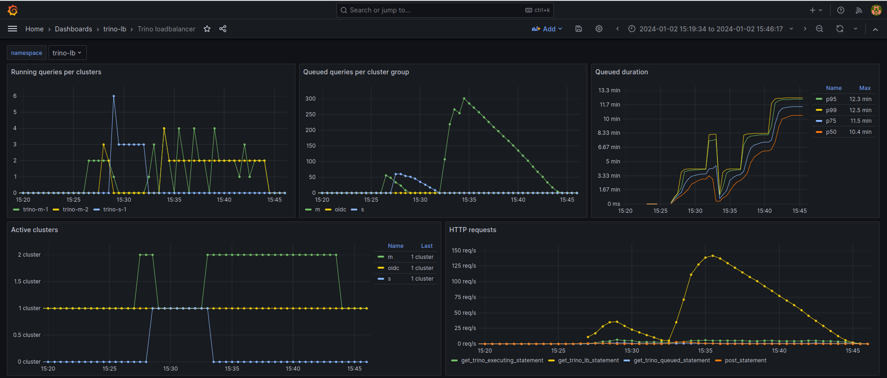
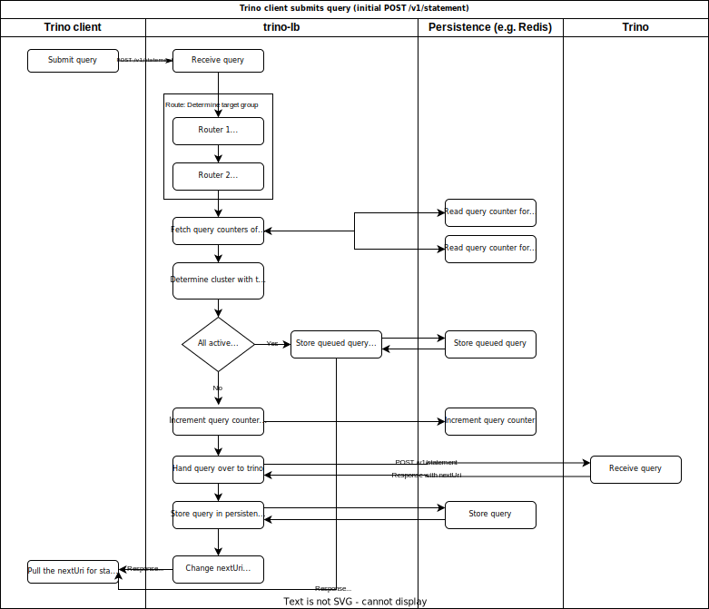

# Design

## Persistence

One important requirement for trino-lb is an highly available setup that can recover from trino-lb restarts without interrupting queued and running queries.
It must also be horizontally scalable to allow a very high number of concurrent queries running through it.

This imposes the following requirements on the underlying persistence:

1. Low latency
2. Atomic operations, such as [Compare-and-swap](https://en.wikipedia.org/wiki/Compare-and-swap)
3. Scalable to enabled scaling trino-lb as well

The trait `trino_lb_persistence::Persistence` (think of an interface) allows for multiple persistence implementations. Currently the following implementations are available:

1. [In-memory](./persistence/in-memory.md): Volatile persistence mainly intended for development or testing purposes.
2. [Redis](./persistence/redis.md): Uses a [Redis Cluster](https://redis.io/docs/management/scaling/) as a distributed key-value store.
3. [Postgres](./persistence/postgres.md): **Experimental**, as performance measurements are missing.

In case you are interested in a implementation for a different persistence please feel free to open an issue or pull request!

## 1. Cluster groups

trino-lb has the concept of so-called "cluster groups" consisting of 1 - n Trino clusters.
The clusters should have similar resources and configurations (e.g. regarding max query runtime and memory limits).
Every cluster group has a limit of how many queries can be send to a single Trino cluster concurrently (regardless if they are queued or running on the cluster) - will be relevant in [a later section](#3-choosing-cluster-from-cluster-group)

You can think of the cluster groups as e.g. the following examples:

* `s` for small, ad-hoc queries consisting of 3 Trino clusters.
* `m` for medium sized queries, such as big `SELECT` statements consisting of 2 Trino clusters.
* `l` (and maybe even `xl`) for big queries, e.g. writing or compacting tables consisting of 1 Trino cluster each.
* `etl-s` and `etl-l` for scheduled tasks, which should not be disturbed by interactive users bombing the clusters, consisting of 1 Trino cluster each.

## 2. Routing to a cluster group

The fist action for every incoming query is to determine the correct cluster group the query should run on.

Each router gets the full information about the incoming query (such as the query string and HTTP headers) and *can* make a decision which cluster group the query should run on.
The router can also return no value e.g. in case it has not enough information to make a decision.
In this case the next router in the chain will be asked.

The configuration of trino-lb can contain a list of routers which will akt as a chain:
The routers will be walked top to bottom and the first router making a decision (by returning a cluster group) will have effect.
In case any router returns a cluster group that does not exist the decision will not be counted and the chain continues.

Currently the following routers are implemented:

1. [TrinoRoutingGroupHeaderRouter](./routing/TrinoRoutingGroupHeaderRouter.md): This router looks at a specific HTTP header (`X-Trino-Routing-Group` by default) and returns the container cluster group in case the header is set.
2. [PythonScriptRouter](./routing/PythonScriptRouter.md): A user-configured python script is called and can do arbitrary calculations in Python the determine the target cluster group by looking at the query and headers passed.
This is the most flexible way of defining routing rules.
3. [ExplainCostsRouter](./routing/ExplainCostsRouter.md): This router executes an `explain {query}` [EXPLAIN](https://trino.io/docs/current/sql/explain.html?highlight=explain) query for every incoming query.
Trino will respond with an resource estimation the query will consume.
Please note that this functional heavily depends on [Table statistics](https://trino.io/docs/current/optimizer/statistics.html) being present for the access tables to get meaningful estimations.
4. [ClientTagsRouter](./routing/ClientTagsRouter.md): Route queries based on client tags send in the `X-Trino-Client-Tags` header.

## 3. Choosing cluster from cluster group

Once the routers have determined which cluster group the query should run a fitting cluster of this group needs to be chosen.
To make the ideal decision, trino-lb will keep an internal counter of the number of queries running on each Trino cluster (which is not a trivial thing in a distributed system :wink:)
For every query the current counters of the clusters in the group are fetched and the query is handed over to the cluster with the fewest queries running.

In case every cluster in the group is already at it's maximum allowed limit of (potentially running) queries on the cluster the query will not be handed over but queued instead.
This can also happen when there is currently no cluster in the group active as the autoscaler stopped all clusters.
This enables spinning an `xl` clusters only on demand (once a `xl` query comes along).

## 4. Queuing queries

As long as no cluster is able to handle the query, the query remains queued in trino-lb.
The mechanism is more advanced than simply delaying the initial POST statement trino clients send, as this would result in HTTP timeouts once the query is queued long enough.

Instead trino-lb gives out a temporary query ID and puts the trino client in a waiting loop, where it periodically polls the trino-lb HTTP API for status updates of the queued query.
This mimics the behavior of Trino when a query is queued in Trino.

However, as we can't influence the query ID the query will get running on Trino this will result in a change og the query ID once the query is handed over to a real Trino cluster. All the tested trio clients so far had no problems with that.

Queued queries that have not been accessed for longer than 5 minutes are removed from the persistence to avoid cluttering the system with abounded queries.
Doing so trino-lb behaves the same way Trino does (the relevant setting in Trino is `query.client.timeout`).

## 5. Autoscaling Trino clusters

You can scale the number of Trino clusters within a group based on the queue length and clusters utilization.
This allows you to significantly save costs by reducing the number of clusters running.

As an extreme this enables you to have on-demand clusters: There are certain `xl` queries which are executed infrequently and need a huge Trino cluster. The group `xl` consists of 0 clusters in normal operation to dramatically cut costs. In case a `xl` query is submitted, the `xl` cluster will be started and the query queued until it is completely ready. After a given time period the `xl` cluster is shut down again.

Currently the following autoscalers are implemented:

1. [Stackable](./scaling/stackable.md): Autoscales [Stackable TrinoClusters](https://docs.stackable.tech/home/stable/trino/), which are part of the Stackable Data Platform (SDP)

## Monitoring

trino-lb emits [OpenTelemetry Metrics](https://opentelemetry.io/docs/concepts/signals/metrics/), which (for now) are only exposed as [Prometheus](https://prometheus.io/) metrics on `http://0.0.0.0:9090/metrics`.

There is also a ready-to-use Grafana dashboards showing the most important metrics.
In the screenshot below you can see the cluster group `m` scaling up from 1 to 2 clusters, as > 300 queries get submitted.
After all queries where executed (queue is emptied) the group `m` was downscaled back to 1 again.

Also, the cluster `trino-s-1` was started on demand, executed the 60 queries and was shut down after again.

## Tracing
trino-lb emits [OpenTelemetry Traces](https://opentelemetry.io/docs/concepts/signals/traces/) to [OTLP](https://opentelemetry.io/docs/specs/otel/protocol/) endpoints such as [Jaeger](https://www.jaegertracing.io/).
When proxy-ing requests to Trino we take care of [OpenTelemetry Propagation](https://opentelemetry.io/docs/instrumentation/js/propagation/), so that the Trino spans will show up within the trino-lb spans.
This enables nice tracing across trino-lb and trino (as seen in the screenshot below)

## Flowcharts

This flowchart represents a Trino client submitting a query.
It might be send to a Trino clusters or queued if all clusters are full.

This flowchart represents a Trino client asking for the current state of a query that is queued in trino-lb.
In case the query will continue to be queued, the client will receive a nextUri pointing to the same endpoint again, resulting in a loop until the query is unqueued.

```mermaid
sequenceDiagram
    actor client as Trino client
    participant lb as trino-lb
    participant persistence as Persistence
    participant trino as Trino

    client ->>+ lb: Submit query using <br/> POST /v1/statement
    opt Determine target cluster group
        lb ->> lb: Router 1 (e.g. PythonScriptRouter)
        lb ->> lb: Router 2 (e.g. ExplainCostsRouter)
    end

    par
        lb ->>+ persistence: Fetch query counters for cluster 1 of group
        persistence ->>- lb: # Don't strip space
    and
        lb ->>+ persistence: Fetch query counters for cluster 2 .. n of group
        persistence ->>- lb: # Don't strip space
    end

    lb ->> lb: Determine cluster with the fewest running queries

    alt All active clusters full
        lb ->>+ persistence: Store queued query
        persistence ->>- lb: # Don't strip space

        lb ->> lb: Construct response that simulates <br/> a queued query on Trino <br/> (by e.g. creating a queryId)
    else clusters have space left
        lb ->>+ persistence: Increment query counter for cluster
        persistence ->>- lb: # Don't strip space

        lb ->>+ trino: Hand query over using POST /v1/statement
        trino ->>- lb: Response containing nextUri

        lb ->>+ persistence: Store query
        persistence ->>- lb: # Don't strip space

        lb ->> lb: Change nextUri to point to trino-lb
    end

    lb ->>- client: Response containing nextUri
```
